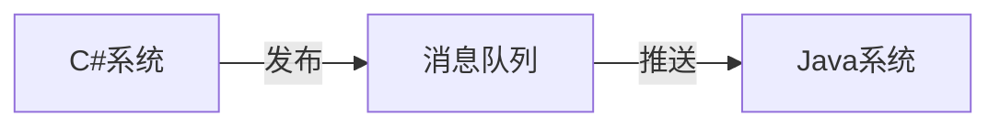
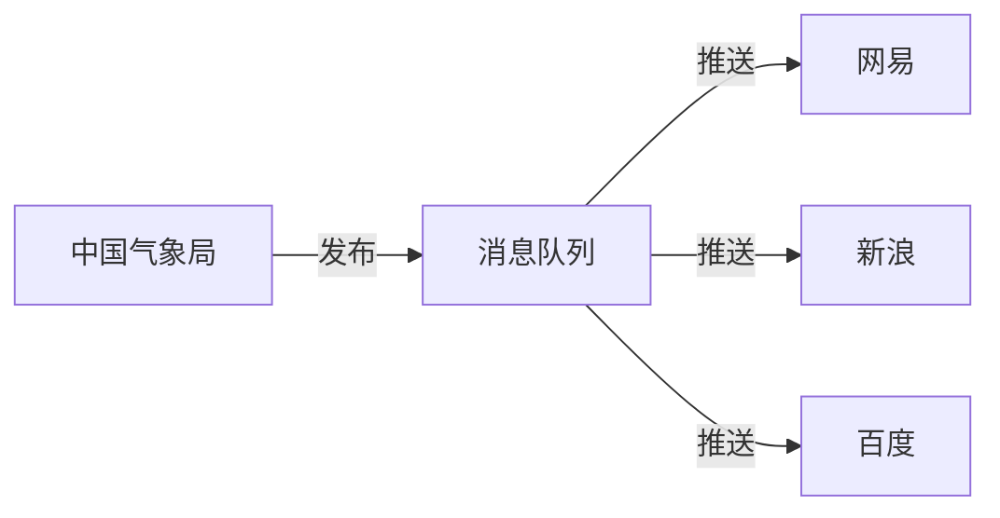

# MQ 的功能及作用

## 解耦

### 异构系统的解耦

```mermaid
graph LR
A[C#系统]--发布-->B[消息队列]--推送-->C[Java系统]
```

### 基于订阅发布的数据分发

```mermaid
graph LR
A[中国气象局]--发布-->B[消息队列]
B--推送-->C[网易]
B--推送-->D[新浪]
B--推送-->E[百度]
```

## 削峰限流

秒杀活动时瞬时 qps 过大，先将请求打入消息队列中，秒杀业务根据消息队列的请求信息进行处理

```mermaid
graph LR
A[秒杀系统]--发布-->B[消息队列]--推送-->C[秒杀系统]

```

## 消息队列对比

### Kafka

### RabbitMQ

### RocketMQ
